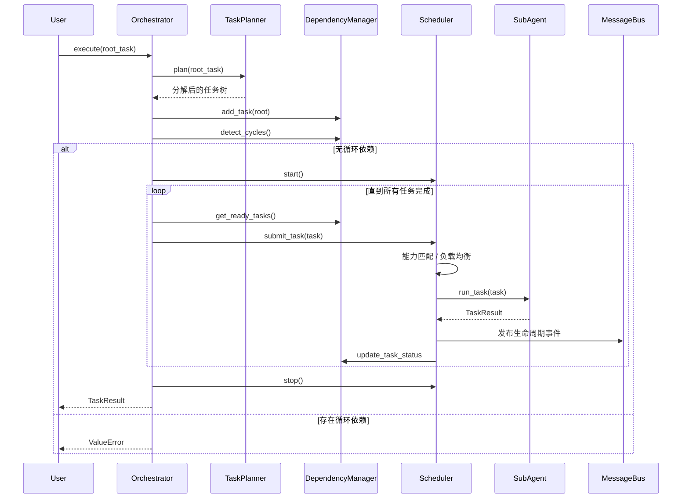

# Multi-Agent 编排核心框架

本项目提供一套轻量级的 Multi-Agent 任务编排框架，支持任务分解、依赖管理、循环依赖检测、
基于能力和负载均衡的调度、带退避的重试机制以及组件间消息通信。

## 架构概述

核心组件职责如下：

| 模块 | 文件 | 职责 |
|------|------|------|
| 任务模型 | `core/task.py` | 定义 `Task`、`TaskResult`、`RetryPolicy`、状态与优先级枚举 |
| 消息总线 | `core/messaging.py` | 支持发布/订阅、广播、同步 request-response |
| SubAgent 基类 | `core/sub_agent.py` | 抽象基类，定义 Agent 能力、负载与任务执行入口 |
| 任务规划器 | `core/task_planner.py` | 按规则递归分解任务，并支持优先级调整 |
| 依赖管理器 | `core/dependency_manager.py` | 维护依赖图、检测循环、生成拓扑执行顺序 |
| 调度器 | `core/scheduler.py` | FIFO/PRIORITY 队列、能力匹配、负载均衡、调度循环 |
| 重试执行器 | `core/retry.py` | 带退避的重试、transient 失败判断、失败隔离 |
| 编排器 | `core/orchestrator.py` | 整合所有组件，提供 `execute(root_task)` 入口 |

## 时序图



## 快速开始

```python
from core.orchestrator import Orchestrator
from core.sub_agent import BaseSubAgent, TaskResult
from core.task import Task
from core.task_planner import TaskPlanner

class PlotPlannerAgent(BaseSubAgent):
    @property
    def agent_type(self):
        return "plot_planner"

    def _run_task(self, task):
        return TaskResult(success=True, output=f"outline for {task.name}")

class WriterAgent(BaseSubAgent):
    @property
    def agent_type(self):
        return "writer"

    def _run_task(self, task):
        return TaskResult(success=True, output=f"draft for {task.name}")

class ReviewerAgent(BaseSubAgent):
    @property
    def agent_type(self):
        return "reviewer"

    def _run_task(self, task):
        return TaskResult(success=True, output=f"review for {task.name}")

orchestrator = Orchestrator()
orchestrator.register_agent(PlotPlannerAgent("plot_1", capabilities=["plot_planner"]))
orchestrator.register_agent(WriterAgent("writer_1", capabilities=["writer"]))
orchestrator.register_agent(ReviewerAgent("reviewer_1", capabilities=["reviewer"]))

# 注册任务分解规则：撰写章节拆分为大纲 -> 初稿 -> 校对
orchestrator.task_planner.register_decomposer(
    predicate=lambda t: t.name == "write_chapter",
    decomposer=lambda t: [
        Task(name=f"{t.name}_outline", capabilities_required=["plot_planner"]),
        Task(name=f"{t.name}_draft", capabilities_required=["writer"]),
        Task(name=f"{t.name}_review", capabilities_required=["reviewer"]),
    ],
)

# 根任务作为容器，不设置 capabilities_required，由子任务结果汇总
root = Task(name="write_chapter")
result = orchestrator.execute(root)
print(result.success, result.output)
```

## 扩展点

1. **自定义 SubAgent**：继承 `BaseSubAgent`，实现 `agent_type`、`capabilities`、`_run_task`。
2. **任务分解规则**：通过 `TaskPlanner.register_decomposer(predicate, decomposer)` 注入。
3. **优先级调整**：通过 `TaskPlanner.register_priority_adjuster(adjuster)` 注入。
4. **调度策略**：在 `config.yaml` 中切换 `scheduler.mode`（FIFO / PRIORITY）。
5. **重试策略**：为任务设置 `retry_policy`，支持固定、线性、指数退避。

## 需求映射

以下说明本框架如何覆盖常见 Multi-Agent 编排场景：

| 需求 | 对应模块 | 说明 |
|------|----------|------|
| 1. 主 Agent 拆解任务并分派给子 Agent | `TaskPlanner` + `Orchestrator` | 通过 `register_decomposer` 定义拆解规则，`Orchestrator.execute` 自动完成规划、调度与执行 |
| 2. 子 Agent 领取任务、分析并调用工具 | `BaseSubAgent` + `ToolSpec` | 子类实现 `_run_task`，内部可调用 `self.tools` 中注册的工具 |
| 3. 主 Agent 并行执行自身任务并等待子 Agent | `DependencyManager` + `Scheduler` | 无依赖的任务会并行派发；主 Agent 可在 `execute` 外部并行提交独立任务 |
| 4. 子 Agent 失败自动重试、失败分类再派发 | `RetryExecutor` + `RetryPolicy` | 支持固定/线性/指数退避，`transient_exceptions` 区分可重试与不可重试异常 |
| 5. 子 Agent 之间直接讨论达成一致 | `MessageBus` | 提供 `subscribe` / `publish` / `request` / `response`，支持多轮协商 |

## 集成方式

- 直接导入 `core.orchestrator.Orchestrator` 并注册 Agent 即可运行。
- `MessageBus` 可用于 Agent 间事件通知或 request-response 通信。
- 调度器在后台线程运行，任务执行结果通过回调同步到 `DependencyManager`。
- 通过 `config.yaml` 调整调度模式、轮询间隔、重试策略等参数。
