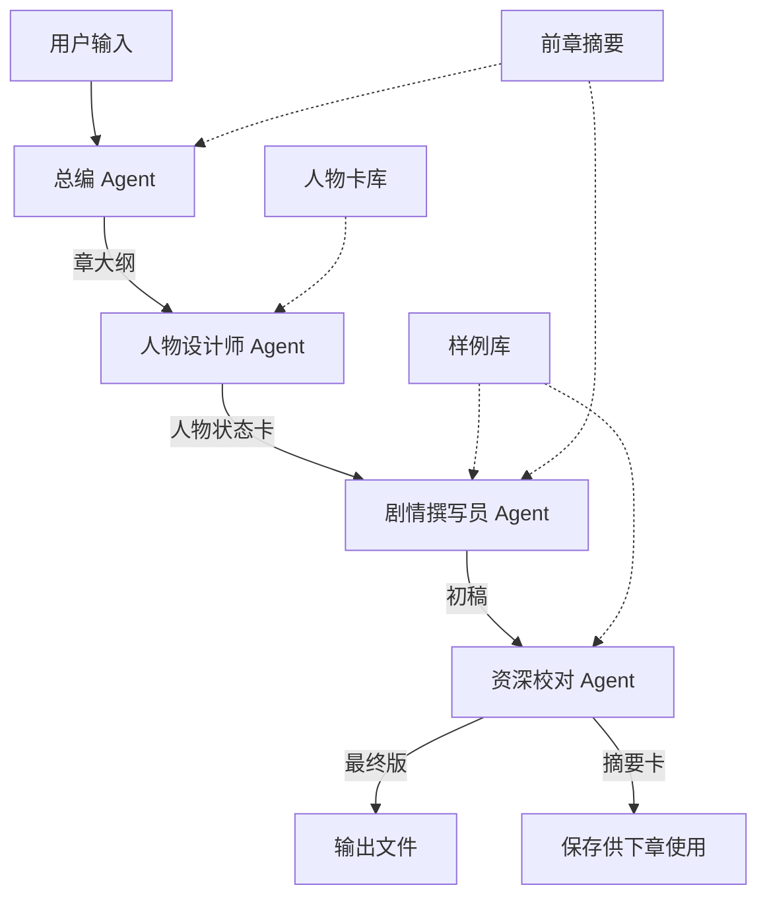

# 工作流定义

> 定义 4 个 Agent 的执行顺序和数据流

---

## 🔄 工作流类型

```yaml
workflow:
  name: "小说章节创作流程"
  type: "sequential"  # 串联模式
  description: "4 个 Agent 按顺序执行，前一个的输出是后一个的输入"
  version: "1.0-方案A"
  upgrade_path: "方案C（Agent间反馈）"
```

---

## 📋 执行步骤

### Step 1: 总编生成章大纲
```yaml
agent: chief_editor
input:
  - volume_outline  # 卷大纲（从用户提供的大纲.md）
  - chapter_id  # 当前章节ID
  - chapter_title  # 章节标题
  - previous_chapter_summary  # 前一章的摘要卡（第1章为null）
output:
  - chapter_outline  # 章大纲
transition: "将章大纲传递给人物设计师"
```

### Step 2: 人物设计师生成人物状态卡
```yaml
agent: character_designer
input:
  - chapter_outline  # 来自总编
  - character_base_cards  # 全局人物基础卡库
  - previous_chapter_character_states  # 前一章的人物状态（第1章为null）
output:
  - chapter_character_states  # 本章人物状态卡
transition: "将人物状态卡传递给剧情撰写员"
```

### Step 3: 剧情撰写员创作初稿
```yaml
agent: plot_writer
input:
  - chapter_outline  # 来自总编
  - chapter_character_states  # 来自人物设计师
  - previous_chapter_summary  # 前一章摘要
  - writing_style_guide  # 写作风格指南（从设计文档）
tools:
  - retrieve_writing_samples  # 可查询样例库
output:
  - chapter_draft  # 章节初稿（3000-5000字）
transition: "将初稿传递给资深校对"
```

### Step 4: 资深校对优化并生成摘要
```yaml
agent: senior_proofreader
input:
  - chapter_draft  # 来自剧情撰写员
  - chapter_outline  # 来自总编（用于对照检查）
  - chapter_character_states  # 来自人物设计师（用于检查人物一致性）
  - proofreading_criteria  # 校对标准（从设计文档）
tools:
  - retrieve_writing_samples  # 可查询样例库
output:
  - chapter_final  # 最终版章节
  - chapter_summary_card  # 章节摘要卡（供下章使用）
transition: "完成，保存输出文件"
```

---

## 🔗 数据流图



---

## ⚙️ 执行控制

### 前置条件检查
```yaml
pre_execution_checks:
  - name: "设计文档完整性"
    validator: "DesignValidator.check_design_documents()"
    required: true

  - name: "人物卡库存在"
    validator: "DesignValidator.check_character_base_cards()"
    required: true
    minimum_characters: 14  # S级4个 + A级10个

  - name: "样例库初始化"
    validator: "DesignValidator.check_samples()"
    required: true
    minimum_samples: 2

  - name: "环境变量配置"
    validator: "DesignValidator.check_environment_variables()"
    required: true
    variables:
      - COMPANY_API_KEY
```

### 执行模式
```yaml
execution_mode:
  parallel: false  # 方案A不支持并行
  retry_on_failure: true
  max_retries: 3
  timeout_per_agent: 600  # 秒
  save_intermediate_results: true  # 保存每个Agent的输出
```

### 错误处理
```yaml
error_handling:
  on_agent_failure:
    - log_error: true
    - save_partial_output: true
    - notify_user: true
    - action: "halt"  # 停止执行，不继续下一个Agent

  on_validation_failure:
    - log_error: true
    - show_validation_report: true
    - action: "halt"
```

---

## 📊 输出文件管理

### 文件命名规范
```yaml
output_files:
  chapter_final:
    path: "output/chapters/chapter_{chapter_id}_final.md"
    format: "markdown"

  chapter_summary:
    path: "output/chapter_summaries/chapter_{chapter_id}_summary.yaml"
    format: "yaml"

  execution_log:
    path: "logs/execution_logs/chapter_{chapter_id}_execution.md"
    format: "markdown"

  performance_metrics:
    path: "logs/performance_metrics/chapter_{chapter_id}_metrics.json"
    format: "json"
```

---

## 🔄 章节间的连续性

### 摘要卡传递
```python
# 伪代码
def run_chapter_n(n):
    # 加载前一章的摘要
    if n > 1:
        previous_summary = load_summary(n - 1)
    else:
        previous_summary = None

    # 执行4个Agent
    outline = chief_editor(chapter_id=n, previous_summary=previous_summary)
    character_states = character_designer(outline, previous_summary)
    draft = plot_writer(outline, character_states, previous_summary)
    final, summary = proofreader(draft, outline, character_states)

    # 保存输出
    save_chapter(final, n)
    save_summary(summary, n)

    return final, summary
```

### 人物状态卡传递
```yaml
character_state_continuity:
  rule: "人物设计师会参考前一章的人物状态卡，更新本章的状态"
  example:
    chapter_1:
      陆商曜:
        relationship_with_薛灵槿: "未出场"
    chapter_5:
      陆商曜:
        relationship_with_薛灵槿: "初次见面，审慎对立"
    chapter_13:
      陆商曜:
        relationship_with_薛灵槿: "建立信任，成为合规盟友"
```

---

## 🎯 质量控制点

### Checkpoint 1: 总编输出后
```yaml
validation:
  - 章大纲是否包含所有必填字段？
  - 人物出场清单是否完整？
  - 伏笔埋设是否与整体大纲一致？
```

### Checkpoint 2: 人物设计师输出后
```yaml
validation:
  - 每个出场人物是否都有状态卡？
  - 对话风格示例是否提供？
  - 人物张力是否明确？
```

### Checkpoint 3: 剧情撰写员输出后
```yaml
validation:
  - 字数是否在 3000-5000 范围内？
  - 是否使用了样例库检索？
  - 是否符合章大纲的所有要点？
```

### Checkpoint 4: 资深校对输出后
```yaml
validation:
  - 是否修正了所有发现的问题？
  - 章节摘要卡是否完整？
  - 是否包含了供下章使用的关键信息？
```

---

## 📈 性能优化建议

### 未来可优化的点
1. **缓存机制**：人物卡库、样例库的缓存
2. **并行查询**：样例库的多个查询可以并行
3. **增量更新**：只更新变化的人物状态卡
4. **Prompt 优化**：根据实际执行效果不断调整

---

## 🔄 升级到方案 C 的准备

### 需要添加的功能
```yaml
feedback_mechanism:
  校对_to_撰写员:
    condition: "发现初稿有重大问题"
    action: "发回重写"
    max_iterations: 2

  撰写员_to_人物设计师:
    condition: "撰写时发现人物卡不足"
    action: "请求补充细节"
    response_time: "实时"

  反馈统合:
    role: "收集所有反馈，决定下一步行动"
    logic: "如果问题可修复 → 返回相应Agent；否则 → 继续流程"
```

---

## ✅ 工作流验证清单

- [ ] 所有 Agent 的输入输出格式是否明确？
- [ ] 数据流是否无缝衔接？
- [ ] 错误处理机制是否完善？
- [ ] 日志和指标收集是否覆盖所有环节？
- [ ] 文件命名和保存是否规范？
