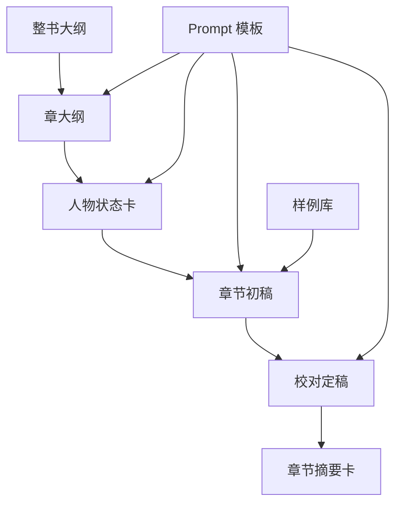

# docs：人工可编辑配置与素材说明

本目录用于集中说明：在运行/迭代小说创作工作流时，哪些文件需要你**人工编辑或维护**，以及这些文件的**位置**与**字段含义**。

## 快速索引

- 环境变量与模型配置：[`env_and_model.md`](env_and_model.md)
- Prompt 模板：[`prompt.md`](prompt.md)
- 人物卡库：[`character_cards.md`](character_cards.md)
- 大纲与样例库：[`outline_and_samples.md`](outline_and_samples.md)

## 常见需要你改动的内容

| 类别 | 主要文件位置 | 是否必需 | 你通常会改什么 |
|---|---|---:|---|
| 环境变量与模型 | [`../.env`](../.env) + 终端环境变量 | 是 | 模型名、API Base URL、密钥环境变量 |
| Prompt 模板 | [`../DESIGN/PROMPTS/`](../DESIGN/PROMPTS/) | 是 | 输出结构、风格约束、任务拆解方式 |
| 人物基础卡库 base_cards | [`../src/novels_project/config/character_base_cards.yaml`](../src/novels_project/config/character_base_cards.yaml) | 是 | 新增/修改人物设定、口吻、底线、动机 |
| 整书大纲 | [`../../First/大纲.md`](../../First/大纲.md) | 推荐 | 世界观、卷纲、人物与势力主线 |
| 章节输入数据 | [`../run.py`](../run.py) 或未来的章节 outline 文件 | 目前是 | 第 N 章标题、节奏标签、爆点规划、前章摘要 |
| 样例库 samples | [`../samples/`](../samples/) | 推荐 | 新增高质量样例、补充元数据与技巧总结 |

## 工作流一览

## 关联文档入口

- MVP 快速开始：[`../MVP_QUICKSTART.md`](../MVP_QUICKSTART.md)
- 人物管理指南：[`../CHARACTER_MANAGEMENT_GUIDE.md`](../CHARACTER_MANAGEMENT_GUIDE.md)
- 混合模式人物系统说明：[`../HYBRID_CHARACTER_SYSTEM.md`](../HYBRID_CHARACTER_SYSTEM.md)
- 模型配置指南：[`../MODEL_CONFIG.md`](../MODEL_CONFIG.md)

## 安全提示

- **不要把真实密钥写进仓库**：密钥统一通过环境变量 `COMPANY_API_KEY` 注入。
- 如果你使用了本地文件 [`../.env`](../.env)，建议保持在 `.gitignore` 中（当前已忽略）。
